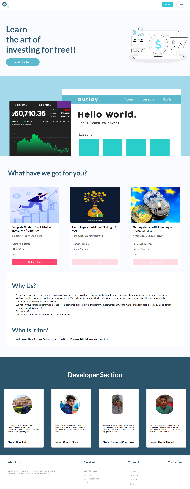
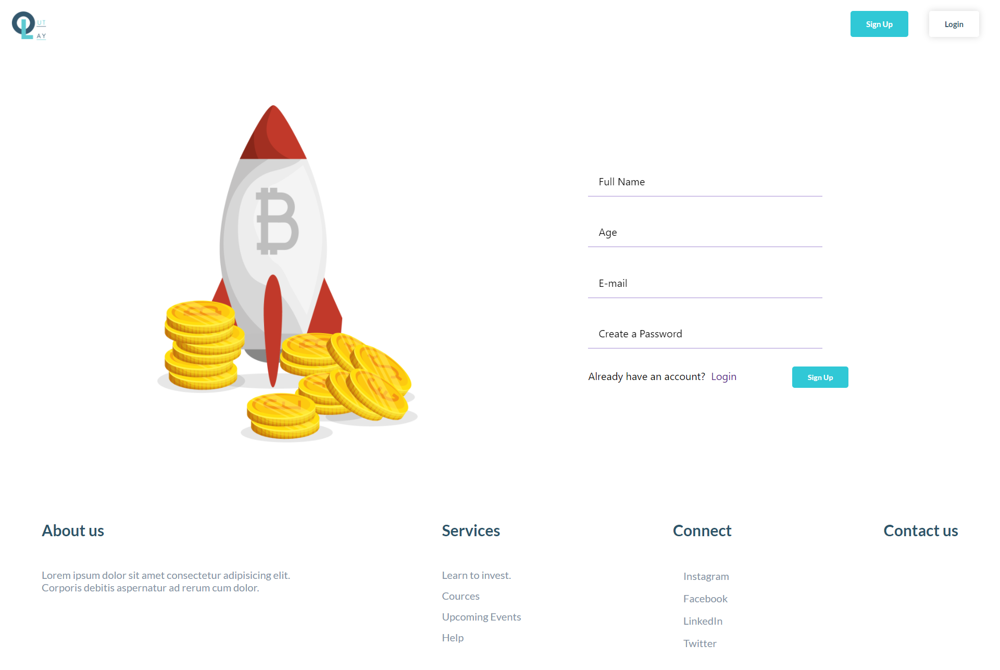
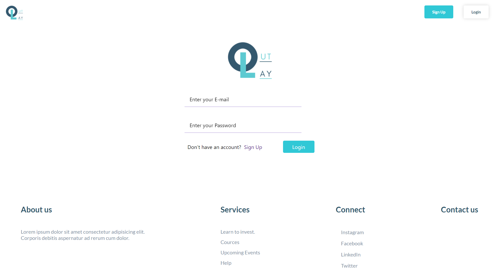
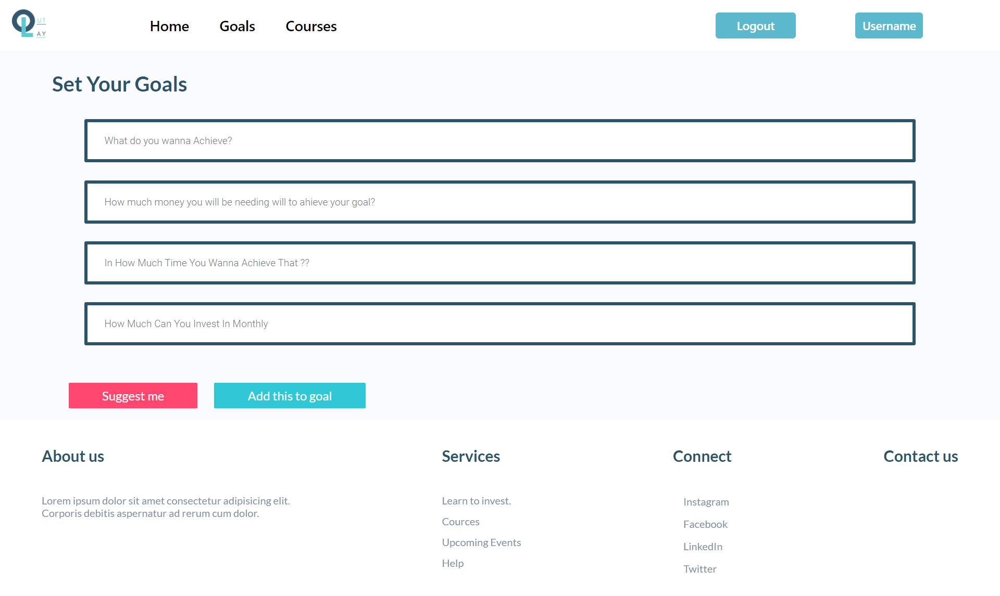
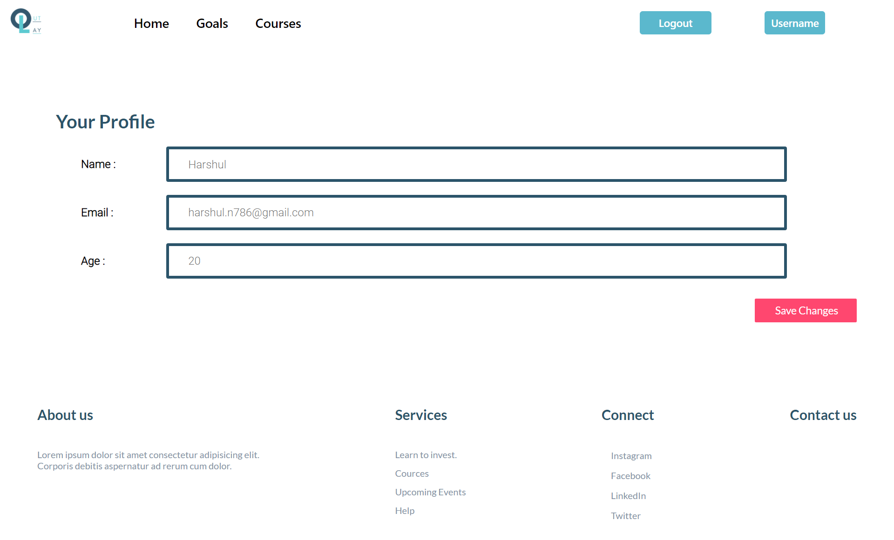
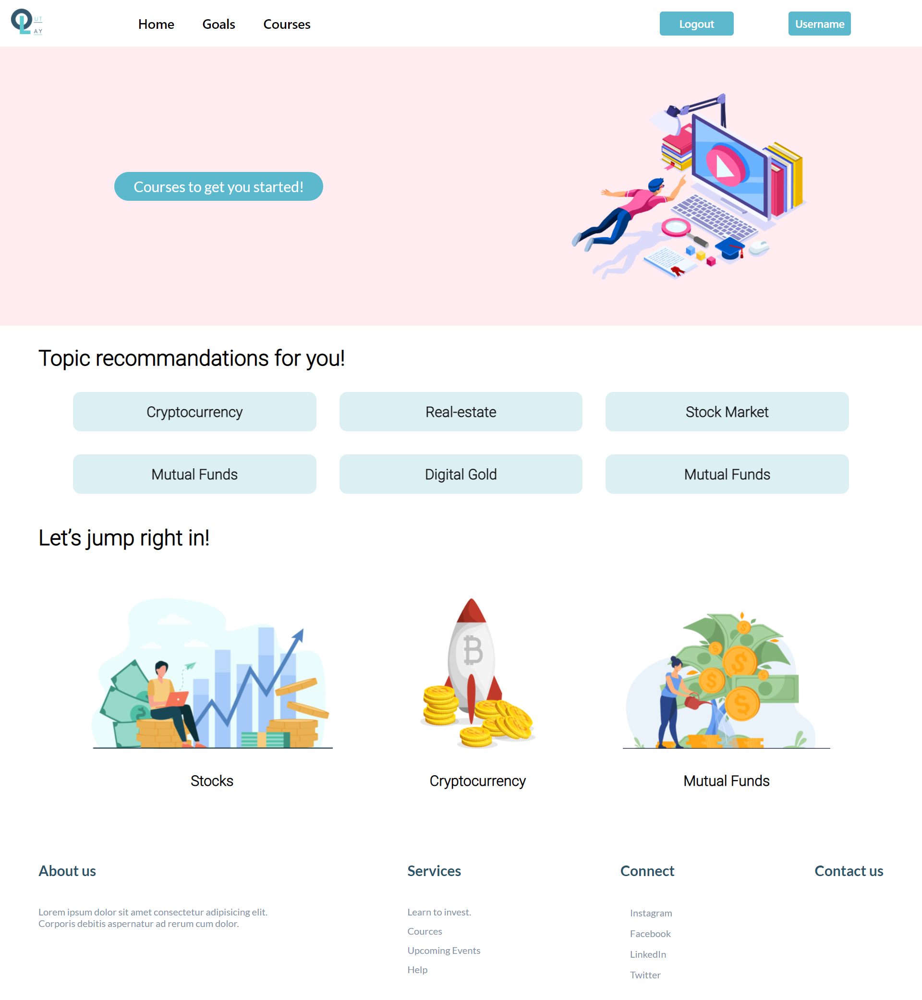

# Outlay

This is the submission project for the CIVO Hackathon

## Features

Some of the main features of our website are:

- [ ] Financial literacy will be provided to all who sign up on our page

- [ ] A test will be conducted after every course completion wherein you will be given some amount and then you will have to invest that and see practical application of your knowledge.

- [ ] You will be recommended courses based on your age and the financial risk you can take at your age.
- [ ] Goals can be updated by the user and hence you will be recommended courses based on that.

## Installation

Installing our website is nothing hard and fast, one needs to fetch backend through forking, and install npm i then, fetch front end and then install npm I, this should be done in both the folders. Then backend has to be started by following certain commands namely node app.js. To start front end just enter the command through npm start. After this, our website is ready for use.

Ways to install or run this **Outlay** on your
machine

- [x] Download [zip file](https://github.com/Guneetsinghtuli/Outlay.git) or Clone the repository [Outlay](https://github.com/Guneetsinghtuli/Outlay.git).

  - [ ] Clone the repository with https or ssh

    

  - [ ] Open Bash/Terminal and run the following  commands

        git clone <-copied_link->

        npm install
        npm start

## Screenshots

This is the overview of EasyBills from Clients side.here are some screen shots of web pages

### Home Page

 

### Signup Page

 

### Login Page

 

### Dashboard Page

 

### Add Goal Page

 

### Profile Page

 

### Course Overview Page

 

### Course info Page

 

### Course Page

 

## Creators

All the people who made this project possible are as follows:

- [ ]Tilak Atri
- [ ]Guneet Singh
- [ ]Divyanshi Choudhary
- [ ]Harshul Namdev◊
